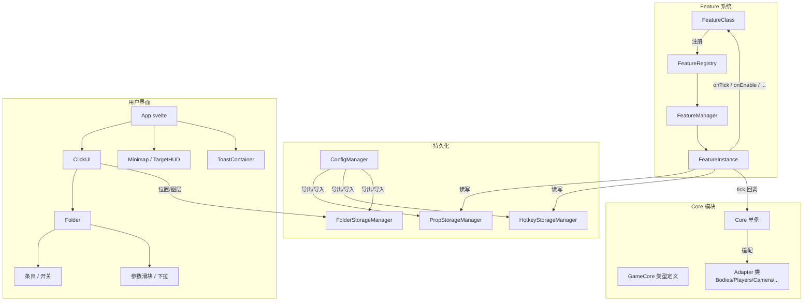

# LokiBox

*LokiBox* 是神奇代码岛 (Box3) 的 Tampermonkey 用户脚本。

## 安装

1. 浏览器安装 [Tampermonkey](https://www.tampermonkey.net/) 扩展
2. [点此下载用户脚本](https://github.com/snowflake-chan/lokibox/releases/latest/download/lokibox.user.js)（`dist/lokibox.user.js`）
3. Tampermonkey 会自动弹出安装页面，点击「安装」
4. 进入任意游戏页面，脚本自动生效

> 首次使用需要注册/登录 LokiBox 账号。

## 功能列表

### ⚔️ Combat（战斗）

| 功能 | 说明 |
|------|------|
| **KillAura** | 自动攻击范围内最近的敌人，可调范围/模式 |
| **AimAssist** | 准星辅助，自动锁定目标 |
| **AutoClicker** | 自动点击 |
| **BlockHit** | 格挡反击 |
| **Stack** | 物品堆叠 |

### 🚀 Movement（移动）

| 功能 | 说明 |
|------|------|
| **Fly** | 飞行模式 |
| **Speed** | 移动加速 |
| **Blink** | 瞬移 — 缓存移动数据，关闭后瞬间回放 |
| **FakeLag** | 假延迟 — 模拟高延迟效果 |
| **SafeWalk** | 走到边缘自动刹停，防掉落；可调触发范围和最小落差 |
| **AirJump** | 空中跳跃 |
| **HighJump** | 高跳 |
| **JetPack** | 喷气背包 |
| **Ghost** | 幽灵模式 |
| **ClickTP** | 点击传送 |

### 👁️ Render（显示）

| 功能 | 说明 |
|------|------|
| **ESP** | 透视 — 显示玩家位置、名称、血量 |
| **Tracers** | 追踪线 — 从屏幕中心指向玩家 |
| **Minimap** | 小地图 |
| **TargetHUD** | 目标信息面板 — 显示当前目标名称、血量、距离 |
| **ClickUI** | 主界面开关 |

### 🛠️ Utility（实用）

| 功能 | 说明 |
|------|------|
| **Scaffold** | 搭路/脚手架 — 自动在脚下放置方块 |
| **AntiAFK** | 防挂机踢出 |
| **AntiFall** | 防摔落 |
| **AntiVoid** | 防虚空掉落 |
| **AntiKnockBack** | 防击退 |
| **Scroller** | 自动滚轮 |

### 🎭 Misc（杂项）

| 功能 | 说明 |
|------|------|
| **AutoEZ** | 自动嘲讽 |
| **BedBreaker** | 破床辅助 |

## 使用教程

### 打开界面

进入游戏后，按Tab打开主菜单。

### 切换功能

主菜单按分类列出所有功能：

- **左键点击** — 开启/关闭功能
- **右键点击功能** — 展开参数面板，可拖拽滑块/切换下拉调整参数
- **功能开启后** 所在行会高亮

### 设置快捷键

打开 **Hotkey** 文件夹：

1. 点击要设置的功能行
2. 按下键盘上的按键（按 `Esc` 取消，`Backspace` 清除）
3. 录制完成后自动保存

支持两种模式：
- **Toggle**（默认）— 按一下开，再按一下关
- **长按启用** — `activateOnHold` 的功能按住时开启，松手关闭

### 配置管理（Config）

打开 **Config** 文件夹：

- **Save（💾）** — 将当前所有设置写入当前配置
- **Add（+）** — 创建新配置（输入名称后回车或点 `→`）
- **加载** — 左键点击配置名
- **导出（⬇）** — 下载单个配置为 `.json` 文件
- **删除（✕）** — 删除配置（双击确认）
- **拖拽导入** — 将 `.json` 配置文件拖入 Config 文件夹自动导入

### 好友系统

**Friend 文件夹** 和 **Player 文件夹** 管理远程好友：

- 查看在线玩家
- 添加/删除好友
- 追踪好友的当前游戏

---

## 开发者指南

### 告诸开发者

>[!CAUTION]
>
> 请勿直接向 `main` 推送。建议流程：
>
> 1. 本地开发时随意 commit（`main` 或临时分支都行）
> 2. 准备推送前切到 feature 分支：`git switch -c feat/short-description`
> 3. 推送到远端并创建 PR：`git push -u origin feat/short-description && gh pr create`
> 4. PR 通过后 squash-merge 到 `main`
>
> 如果嫌每次开分支麻烦，可以退一步：所有人推到一个 `dev` 分支，稳定后再合并到 `main`。关键是 `main` 保持可发布状态。
>
> 为了项目的可持续性，请确保您的代码质量；我们保留拒绝低质量 Pull Requests 的权利。
>
> 本项目的名义开发者为 Loki Hackers 团队；之前一切公开行动过的组织皆与本项目无关。

### 技术栈

| 层 | 选型 |
|----|------|
| 框架 | Svelte 5（runes 模式：`$state` / `$derived` / `$effect` / `$props`） |
| 语言 | TypeScript |
| 构建 | Vite + `vite-plugin-monkey`（输出 .user.js） |
| 测试 | Vitest |
| 包管理 | pnpm |

### Feature 开发

自 *LokiBox* v2.0 重构以来，Feature 的状态管理、存储、热键调用均由管理器自动进行。

创建一个 Feature 只需要：

```typescript
import { Feature, FeatureBase, type FeatureContext } from 'src/features/registry';

@Feature({
  id: 'my-own-feature',
  displayName: 'My Own Feature',
  folderId: 'combat',
})
class MyOwnFeature extends FeatureBase<MyOwnFeature> {
  onEnable(ctx: FeatureContext<MyOwnFeature>) {
    // Feature 逻辑
  }
}
```

`@Feature` 装饰器用于将 Feature 类注册到管理器。注册后的 Feature 可以使用管理器的自动化参数同步传递、持久化、UI 等功能。

一切 Feature 应放在 `src/features/[folder-id]/[feature-id].ts` 中，入口函数通过 `import.meta.glob` 统一加载。

#### 默认值

`FeatureBase` 中预留了一些属性来控制 Feature 的默认值：

```typescript
class MyOwnFeature extends FeatureBase<MyOwnFeature> {
  defaultHotkey = 'f';       // 默认热键
  defaultEnabled = false;    // 默认开关状态
  activateOnHold = true;     // 长按启用
}
```

#### 参数管理

通过 `ctx.props.propKey` 读写 Feature 参数，参数会自动持久化到 GM storage：

```typescript
import { props } from 'src/features/schema';

class MyOwnFeature extends FeatureBase<MyOwnFeature> {
  schema = {
    myOwnProp: props.number('My Own Prop', {
      default: 0.5,
      min: 0.1,
      max: 1.0,
      step: 0.01,
    }),
  };

  onTick(ctx: FeatureContext<MyOwnFeature>) {
    console.log(ctx.props.myOwnProp);
  }
}
```

支持的参数类型：`props.boolean`、`props.number`、`props.select`、`props.range`。

### 项目架构

```
boot.ts（入口，按 URL 分支）
├── dao3.fun/play/*  →  bridge/top（聊天注入、Auth 中继）
└── view.dao3.fun/*  →  Core + initApp()
     ├── 未认证  →  auth/main（登录/注册 UI）
     └── 已认证  →  main.ts → App.svelte
```

#### 核心模块

| 模块 | 说明 |
|------|------|
| `src/core/` | `Core` 单例通过原型劫持捕获游戏原始对象，通过 Adapter 类（`CoreBodies`、`CorePlayers`、`CoreCamera` 等）提供类型安全 API |
| `src/features/` | Feature 系统：`@Feature` 装饰器注册 → `FeatureRegistry` → `FeatureManager` → `FeatureInstance` 生命周期管理 |
| `src/storage/` | 持久化：`PropStorageManager`（Feature 状态+参数）、`HotkeyStorageManager`（快捷键）、`FolderStorageManager`（位置/图层顺序）、`ConfigManager`（整套配置导入/导出/Profile） |
| `src/ui/` | Svelte 5 组件：`ClickUI`、`Folder`、`Entry`、`Controller`（参数滑块/开关/下拉）、`ToastContainer` |
| `src/render/` | 视觉覆盖层：Minimap、TargetHUD |
| `src/bridge/` | 顶层页面 ↔ iframe 通信（聊天消息、Auth token 中继） |
| `src/auth/` | LokiAPI 认证（登录/注册流程） |
| `src/api/` | 服务器 API 封装（加密请求、Presence、好友、搜索） |
| `src/utils/` | 工具：`EventBus`、`Logger`、`ToastManager`、数学工具 |

#### 数据流


